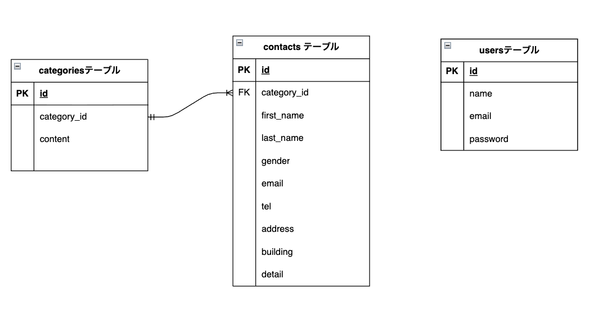

# アプリケーション名

顧客からの問い合わせを管理するWebアプリケーション

## 環境構築

リポジトリのクローン
・git clone git@github.com:miho-102/confirm-test.git
・cd confirm-test(例)
・git remote set-url <リモート名> <新しいURL>
・git remote -v
・git add .
・git commit -m "リモートリポジトリの変更"
・git push origin main

Dockerの設定
・docker-compose up -d --build
・code .

Laravelのパッケージのインストール
・docker-compose exec php bash
・composer install

.envファイルを作成
・cp .env.example .env
・exit
docker-compose.ymlで作成したデータベース名、ユーザ名、パスワードを.envファイルに記述する。

マイグレーションの設定と実行
・php artisan make:migration create\_テーブル名\_table
・php artisan migrate

シーダーファイルの作成
・php artisan make:seeder <テーブル名>
シーダーファイルの実行
・php artisan db:seed

アプリケーションの起動
・php artisan key:generate

### 開発環境

・お問い合わせ画面：http://localhost/
・ユーザー登録：http://localhost/register
・ユーザーログイン：http://localhost/login
・管理画面：http://localhost/admin

#### 使用技術(実行環境)

・PHP 8.5.1
・Laravel 8.83.29
・jquery 3.7.1.min
・MySQL 8.0.26
・nginx 1.21.1

##### ER図

